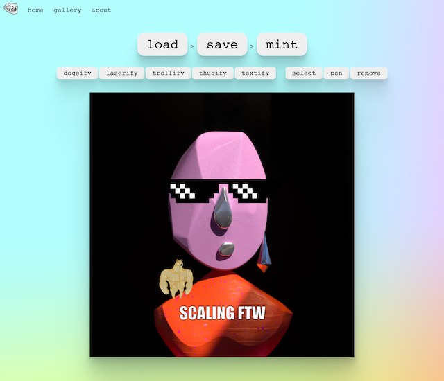

# Flaunt

Meme-ify your NFTs.

Enabling NFT owners to generate derivative assets (new NFTs) from items they already own. These can then be sold, licensed, flaunted, etc.



## Installation

Install the dependencies with the following (assuming you have [yarn](https://classic.yarnpkg.com/en/) installed).

```bash
yarn
```

Spin up a local chain and migrate the contracts.

```bash
truffle develop
$ migrate
```

Start the front-end.

```
yarn start
```

## Networks

### Layer 1

- Kovan L1: 0xe41eE07A9F41CD1Ab4e7F25A93321ba1Dc0Ec5b0
- SKALE L2: 0x6bef29BdBf7de18caf2fA2422A4ec3d4c7d0a064
- Arbitrum Kovan4 - 0xe41eE07A9F41CD1Ab4e7F25A93321ba1Dc0Ec5b0

## Libraries

- [ethers](https://docs.ethers.io/v5/)
- [ipfs-mini](https://github.com/silentcicero/ipfs-mini)
- [react-sketch](https://github.com/tbolis/react-sketch)
- [react-router](https://reactrouter.com/)
- [react-svg](https://www.npmjs.com/package/react-svg)
- [react-bulma-components](https://www.npmjs.com/package/react-bulma-components)
- [openzeppelin-contracts](https://github.com/OpenZeppelin/openzeppelin-contracts)

## Inspiration

- https://github.com/yusefnapora/minty
- https://github.com/contextart/nfte
- https://nft.storage/

## TODO

- [ ] Directories (components, etc)
- [x] Ability to load an existing NFT (address bar / id)
- [x] Ability to meme-ify (sketch on top, add icons, emojis, etc)
- [x] Ability to save generated metadata to IPFS (and recieved CID)
- [x] Ability to generate the derivative (new) NFT on an L2
- [ ] Ability to move asset back to L1 via bridge
- [x] Ability to view what other people have created, etc (should be just incrementing the ids)
- [x] Ability to flaunt.wtf via a custom route for each asset
